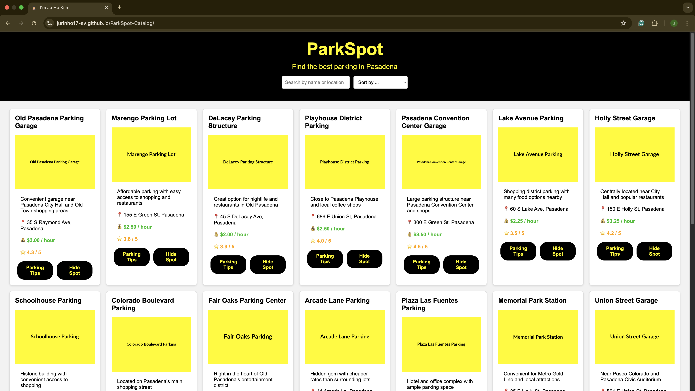
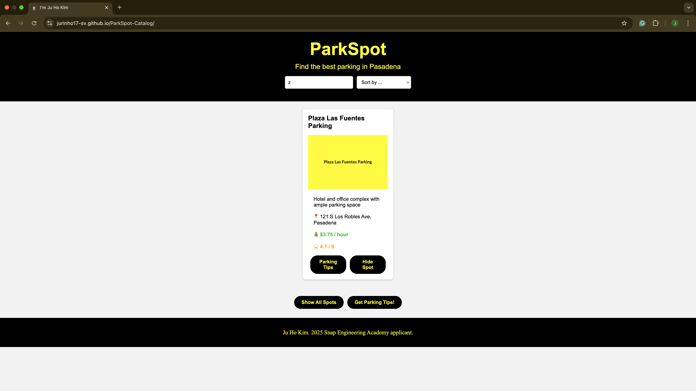
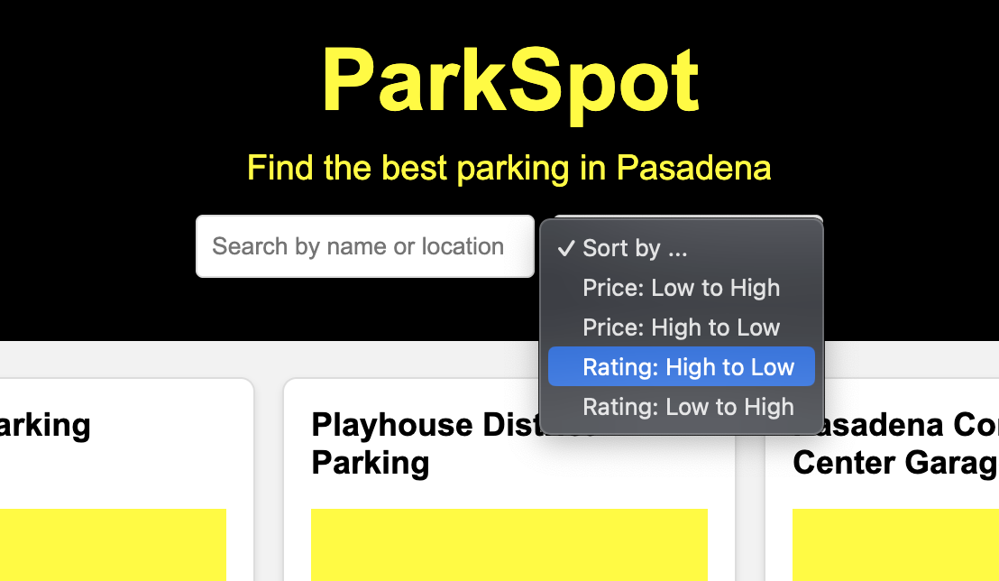

# ParkSpot - Pasadena Parking Catalog

## Live Demo (GitHub page)

ParkSpot: [https://jurinho17-sv.github.io/ParkSpot-Catalog/](https://jurinho17-sv.github.io/ParkSpot-Catalog/)

## Screenshots

### Catalog Page

### Search Functionality ("z" typed in the search box)

### Sorting Functionality

## Project Description
I made a parking spot catalog website called "ParkSpot" that shows information about parking locations in Pasadena.

## Data Used
I created a fictional dataset of real parking spots in Pasadena with properties like name, location, price, rating, and description. I stored this data as an array of objects.

## Features/Operations
- **Search Function**: Users can filter parking spots by typing in the search box, which matches against either the name or location of each spot. I used JavaScript's array.filter() and string.includes() methods to find matching spots.
- **Sorting Function**: Users can sort parking spots by price (Low to High, High to Low) or by rating (High to Low, Low to High) using a dropdown menu. This feature uses JavaScript's array.sort() method with comparator functions.

## What I Learned
- Work with arrays and objects
- Create and modify DOM elements with JavaScript
- Use array methods like filter(), sort(), and map()
- Implement search(OPERATION 1) and sort(OPERATION 2) functionality
- Use template literals for cleaner string formatting

## Future Improvements
If I had more time, I would add:
- A map view showing the locations
- The ability to save favorite parking spots
- Real-time availability sorting option (if allowed)
- User ratings and reviews

## Resources Used
- MDN Web Docs for JavaScript reference
- W3Schools for JavaScript reference
- Youtube clips
- [Placeholder.com](https://placehold.co/) for placeholder images

---
By Ju Ho Kim - SEA 2025 Applicant